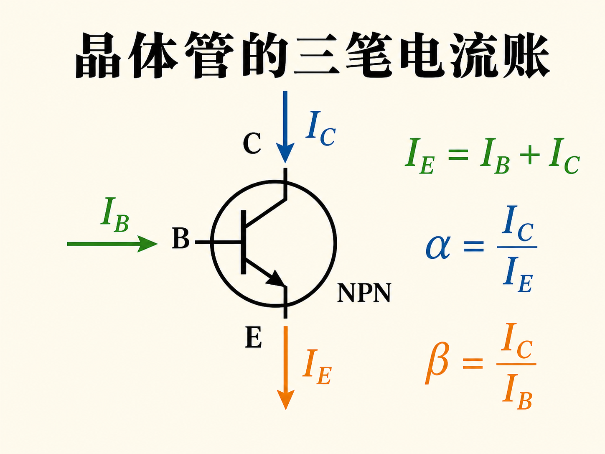
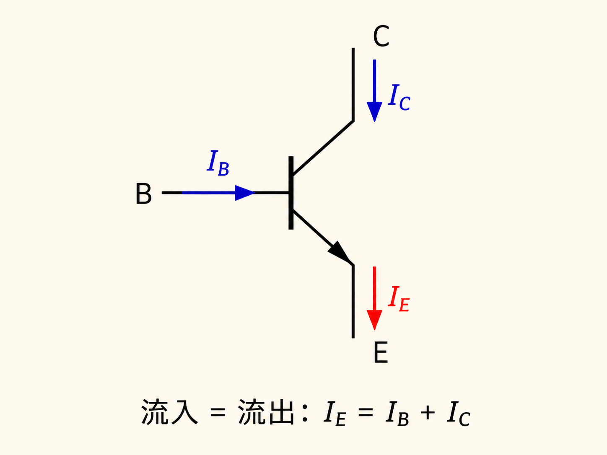
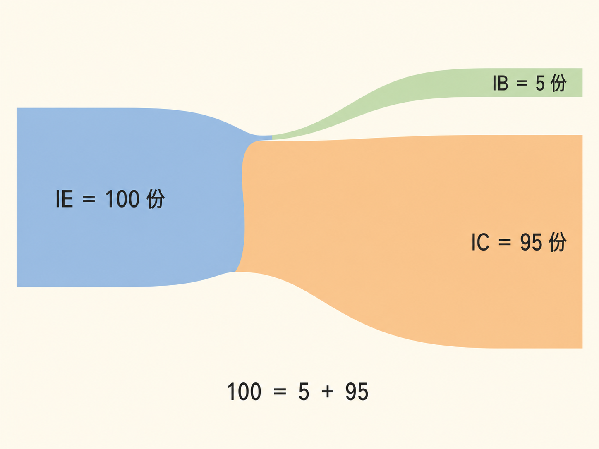
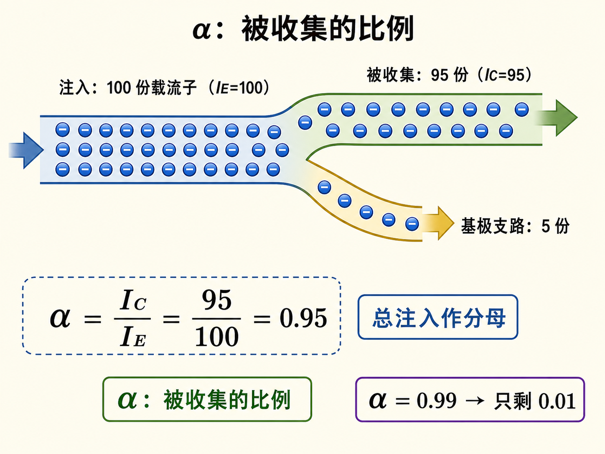
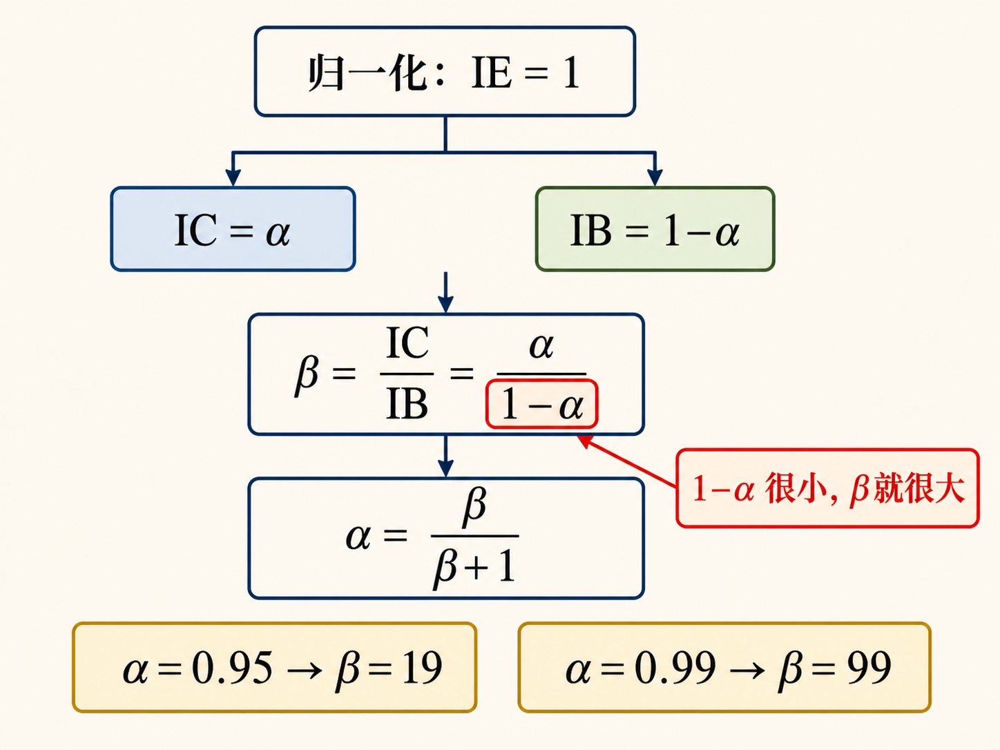

# α 只差一点点，β 为什么会差很多

一只 NPN 晶体管有三条电流：基极电流 $I_B$、集电极电流 $I_C$、发射极电流 $I_E$。它们不是三笔互不相干的账，而是同一批载流子在三个端口之间的分流。

只要先把总账对上，$\alpha$ 和 $\beta$ 的关系就不用死背。

## 三端电流先服从同一条守恒式

在常用的 NPN 放大连接中，约定电流从集电极和基极流入器件，再从发射极流出。因此流入总量必须等于流出总量：

$$I_E=I_B+I_C.$$

从电子角度看方向相反，但“电子往哪走”和“约定电流箭头往哪画”不能混为一谈。无论选哪种视角，端口处的电荷都不能凭空积累，守恒式不会变。

## 把发射极的 100 份电流拆开看

假设发射极对应 100 份电流。电子进入薄基区后，少部分与空穴复合，需要基极支路补充；把这部分记成 5 份。其余 95 份被反偏集电结收集，对应集电极电流。

于是 $I_E=100$、$I_B=5$、$I_C=95$，刚好满足 $100=5+95$。这组数字不是某只器件的固定规格，只是把分流关系画清楚的例子。

## α 衡量“总注入中有多少被收集”

定义

$$\alpha=\frac{I_C}{I_E}.$$

上例中 $\alpha=95/100=0.95$。$\alpha$ 越接近 1，表示越多发射极电流到达集电极、越少分到基极支路。发射极掺杂、基区厚度和掺杂都会影响这个比例；在选定工作条件下，可以用一个近似的 $\alpha$ 描述它。

注意，$\alpha$ 不会因为“接近 1”就失去区别。0.95 与 0.99 看起来只差 0.04，但剩给基极支路的比例分别是 0.05 与 0.01，相差五倍。

## β 是用小支路当分母重新量一次

定义

$$\beta=\frac{I_C}{I_B}.$$

上例中 $\beta=95/5=19$。它比较的是集电极输出电流与基极控制电流，因此常称电流增益。

把 $I_E$ 归一化为 1，$I_C$ 就是 $\alpha$，而 $I_B$ 由守恒得到 $1-\alpha$。所以

$$\beta=\frac{\alpha}{1-\alpha},\qquad \alpha=\frac{\beta}{\beta+1}.$$

这解释了为什么 $\alpha$ 只向 1 靠近一点，$\beta$ 却会迅速增大：真正决定放大倍数的是那份越来越小的“余量” $1-\alpha$。$\alpha$ 与 $\beta$ 不是两种独立本领，只是用总电流和小支路电流分别作分母，看同一次分流。
