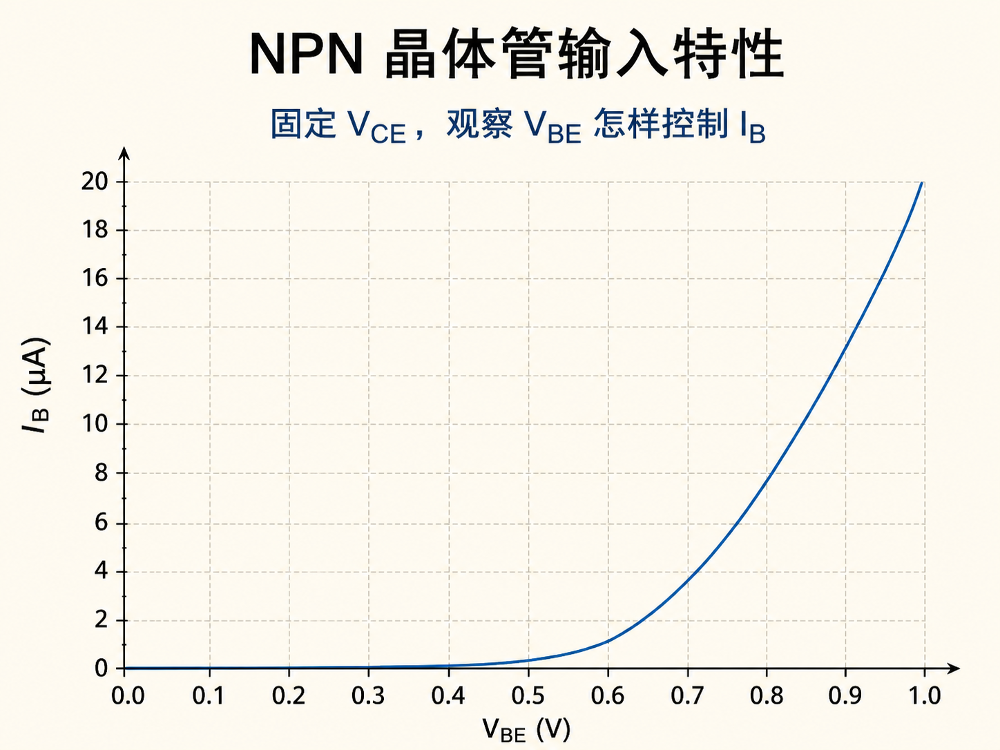
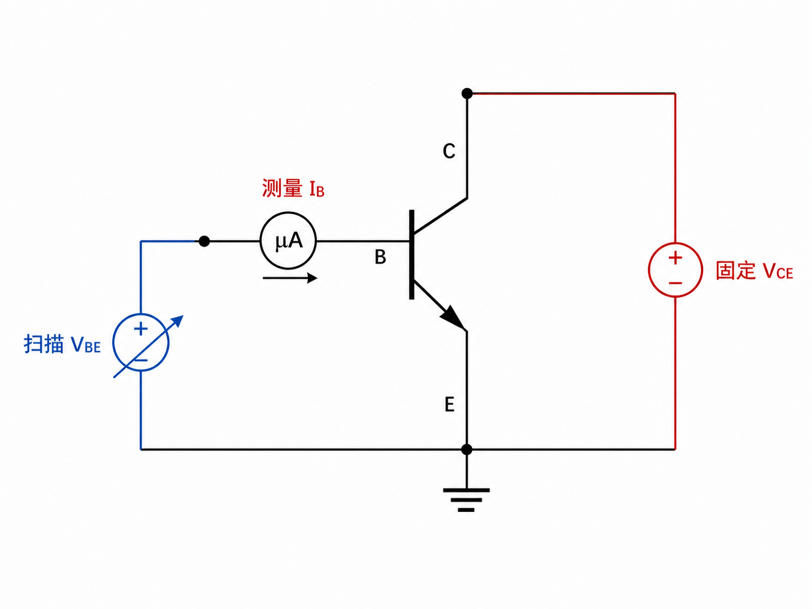
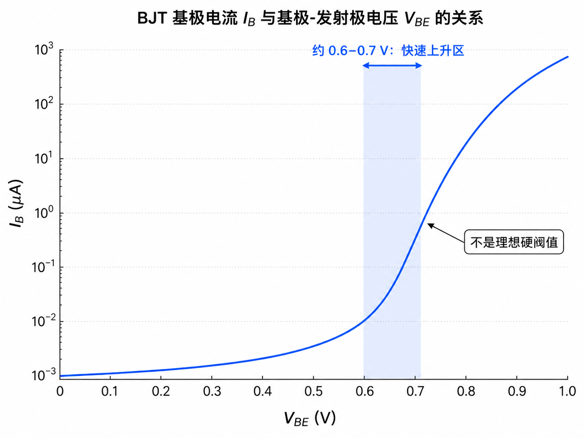
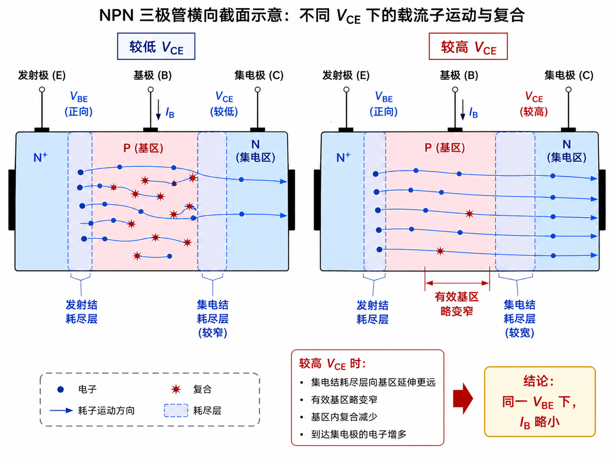
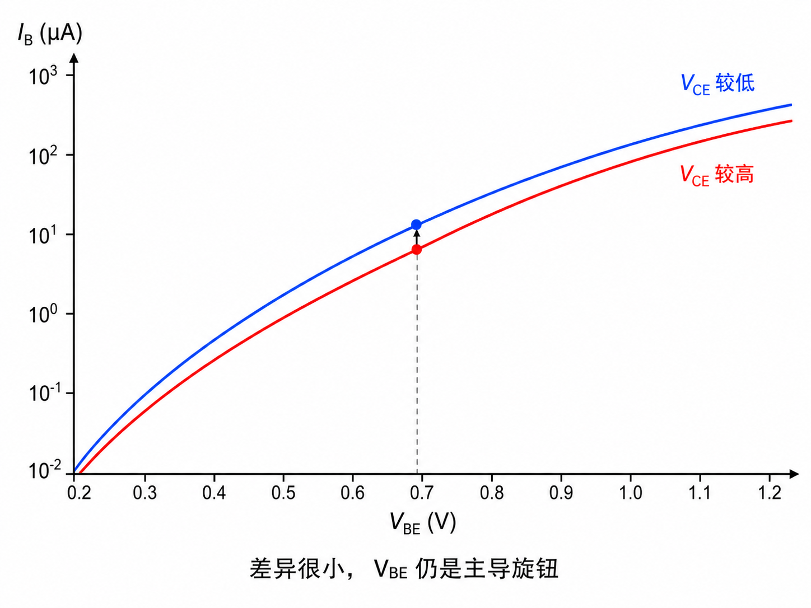

# NPN 晶体管的输入曲线为什么像一只二极管

研究晶体管输入端，问题可以收缩成一句话：基极—发射极电压 $V_{BE}$ 改变时，基极电流 $I_B$ 怎样变化？

为了只看这一对因果关系，测量时要把集电极—发射极电压 $V_{CE}$ 固定住。于是输入特性就是“固定 $V_{CE}$ 时的 $I_B$–$V_{BE}$ 曲线”。

## 输入端本质上是一只正向偏置 PN 结

基极与发射极之间形成 PN 结。$V_{BE}$ 很小时，结势垒仍然明显，电子注入很少，$I_B$ 也很小。随着正向电压升高，势垒降低、耗尽区变窄，注入迅速增强，曲线开始陡升。

因此，这条曲线不是凭空出现的“晶体管专属形状”，而是发射结正向伏安特性在三端器件中的表现。

## 0.6–0.7 V 是拐弯范围，不是理想门槛

对常见硅晶体管，电流常在约 0.6–0.7 V 附近变得明显。低于这个范围并非绝对没有电流，高于它也不是突然跳到某个固定电流；真实曲线连续而陡峭。

所以工程上说“约 0.7 V 导通”，是在给连续曲线选一个方便的工作尺度。它提醒我们：若 $V_{BE}$ 太低，$I_B$ 很小，随之可控制的 $I_C$ 也很小，放大作用难以建立。

## 为什么测输入曲线时必须固定 VCE

$V_{CE}$ 虽然属于输出侧，却会轻微影响输入侧。提高 $V_{CE}$ 会加大集电结反偏，使其耗尽区向基区扩展。有效基区变窄后，注入电子在基区复合的机会略少，于是同一 $V_{BE}$ 下需要的 $I_B$ 略小。

如果测量过程中同时改变 $V_{BE}$ 和 $V_{CE}$，就无法判断 $I_B$ 的变化究竟来自哪一个电压。固定 $V_{CE}$，就是把第二个旋钮锁住。

## 多条输入曲线很接近，主导旋钮仍是 VBE

在不同固定 $V_{CE}$ 下得到的曲线会有轻微偏移，但字幕强调这种差异通常很小。曲线整体仍由发射结控制：$V_{BE}$ 决定注入强弱，$V_{CE}$ 只通过集电结耗尽区对基区复合施加次级影响。

这也给“输入特性”一个清晰含义：它不是只画一条好看的曲线，而是在控制其他条件后，测出输入电压如何支配输入电流。
