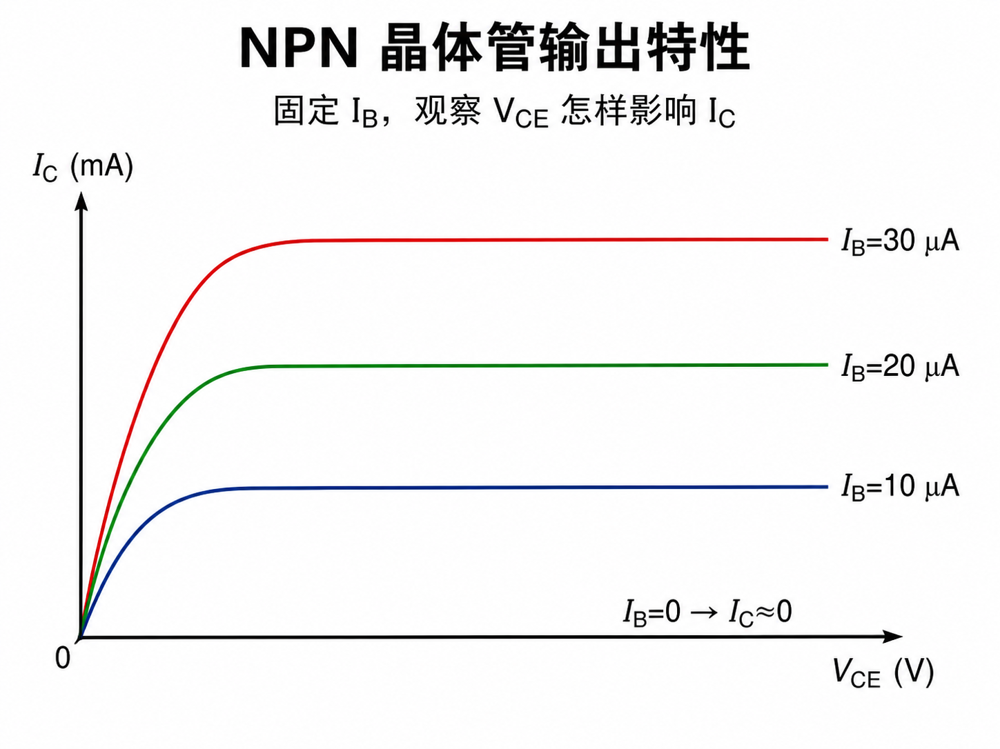
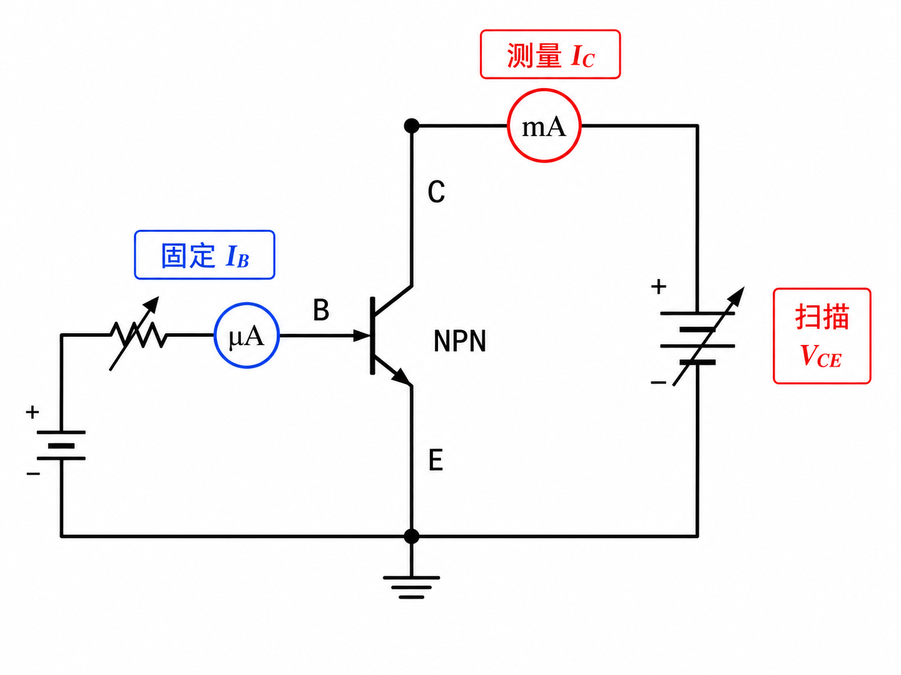
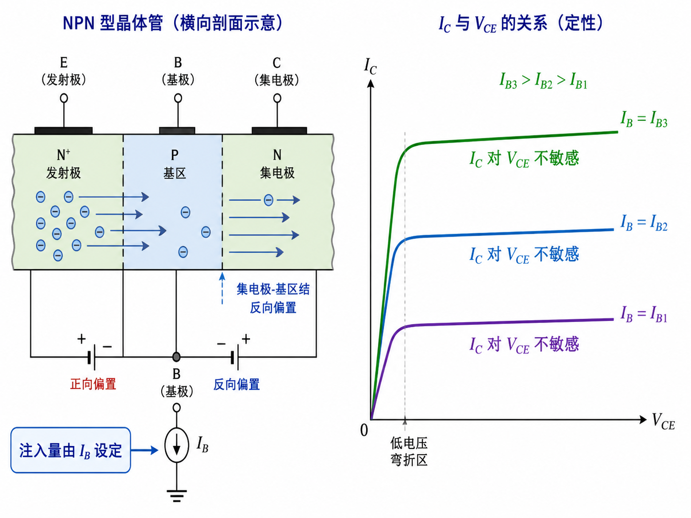
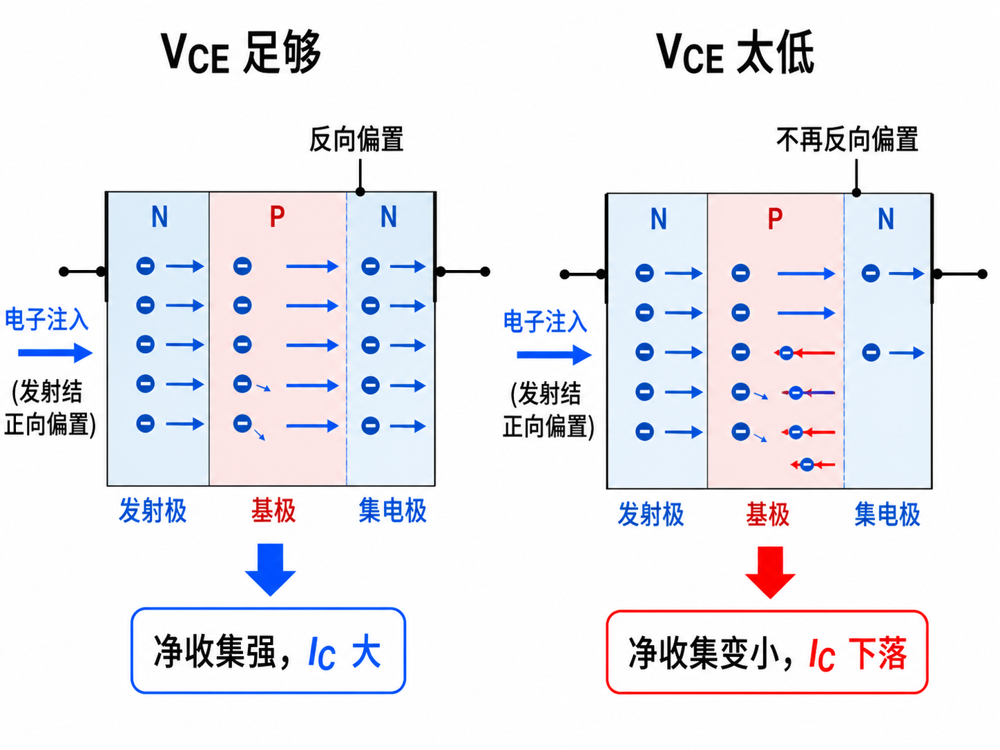
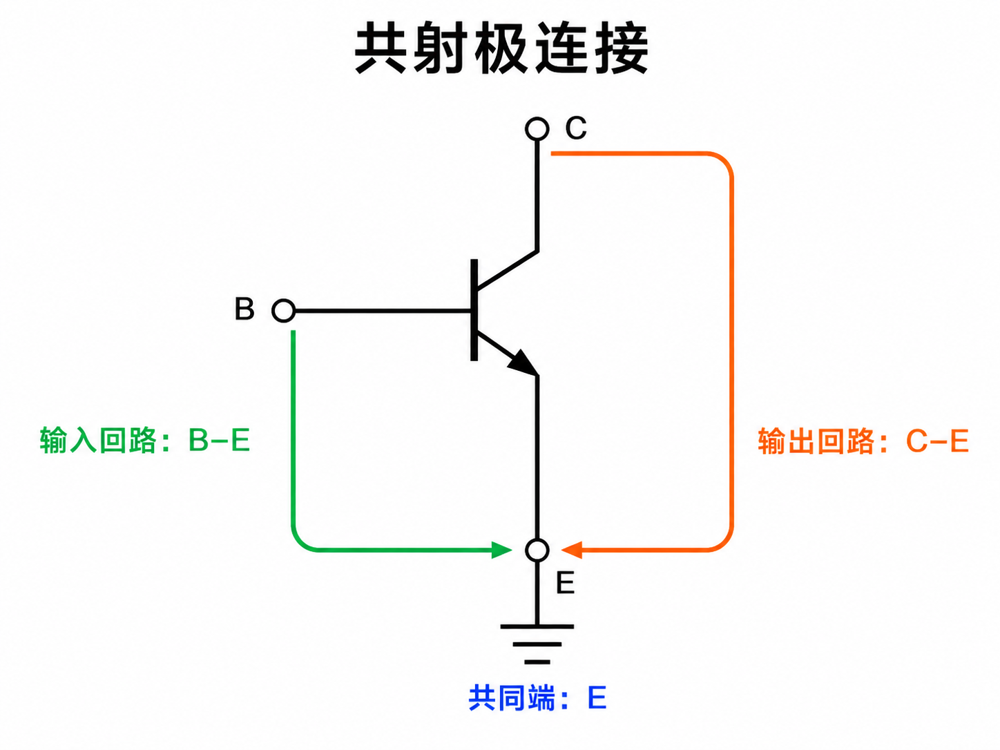

# 为什么晶体管输出曲线大部分是平的

输出特性要回答的是：固定基极电流 $I_B$ 后，改变集电极—发射极电压 $V_{CE}$，集电极电流 $I_C$ 会怎样变化？

“固定 $I_B$”是实验的关键。否则输入旋钮也在动，我们就分不清 $I_C$ 的变化来自 $I_B$ 还是 $V_{CE}$。

## 集电结保持反偏时，IC 主要由注入量决定

只要集电极电位足够高，集电极—基极结保持反向偏置。发射极注入基区的电子，大部分都会被结区电场扫入集电极。

此时提高 $V_{CE}$，并不会凭空制造更多注入电子；电子总量主要由输入侧 $I_B$ 决定。因此固定 $I_B$ 后，$I_C$ 随 $V_{CE}$ 只略有变化，输出曲线呈近似水平的平台。

## VCE 太低时，收集端不再只负责“收集”

当 $V_{CE}$ 降低到使集电极电位接近基极电位，集电结的反向偏置减弱，甚至转为正向偏置。扫动电子的电场变弱，集电极中的电子还会反向扩散进基区。

两个效应都减少从发射极到集电极的净电子输运，所以 $I_C$ 不再维持平台，而会在低 $V_{CE}$ 端明显下落。若想获得预期放大，工作点就不能落在这段转弯区。

## 每一个固定 IB，都对应一条平台高度

若把 $I_B$ 加倍，发射极注入量随之增加，在集电结仍反偏的范围内，$I_C$ 也近似加倍。依次固定不同 $I_B$ 并扫描 $V_{CE}$，就得到一族上下排列的输出曲线。

横向看同一条曲线，是在问 $V_{CE}$ 的影响；纵向比较不同曲线，是在看 $I_B$ 怎样设定 $I_C$ 的主要水平。这两个方向不能混读。

## “共射极”说的是两个回路共用谁

输入回路连接基极—发射极，输出回路连接集电极—发射极。发射极同时出现在两个回路里，所以这种连接叫共射极。

因此，共射极输入特性固定 $V_{CE}$ 看 $I_B$–$V_{BE}$；共射极输出特性固定 $I_B$ 看 $I_C$–$V_{CE}$。两张图分别锁住一个旋钮，才把三端器件拆成可测的两组关系。
