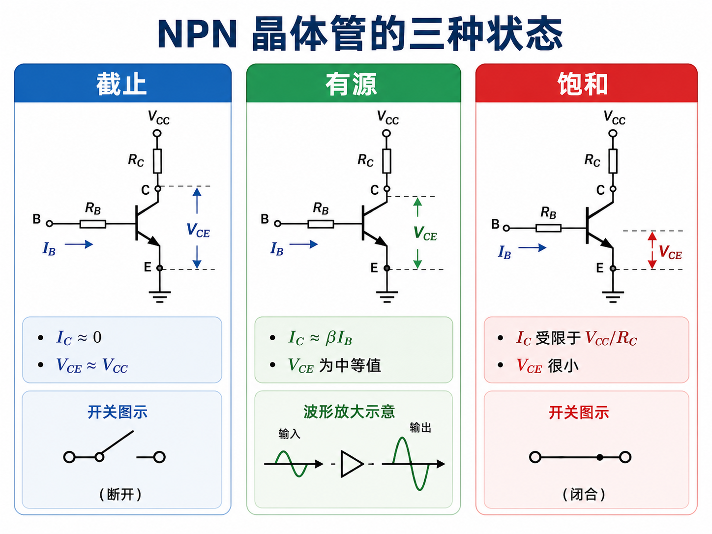
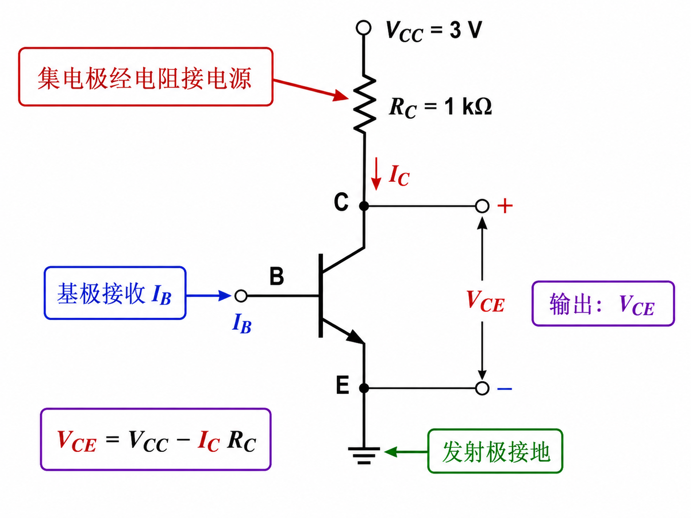
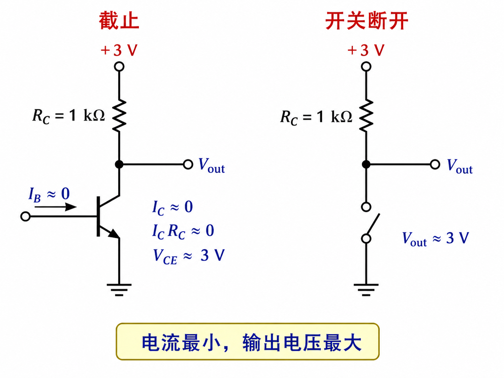
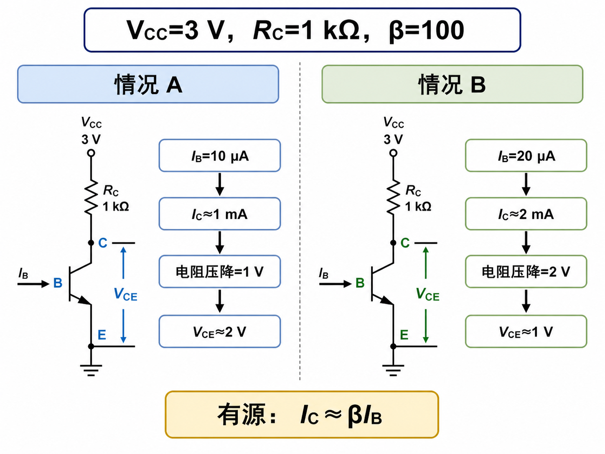
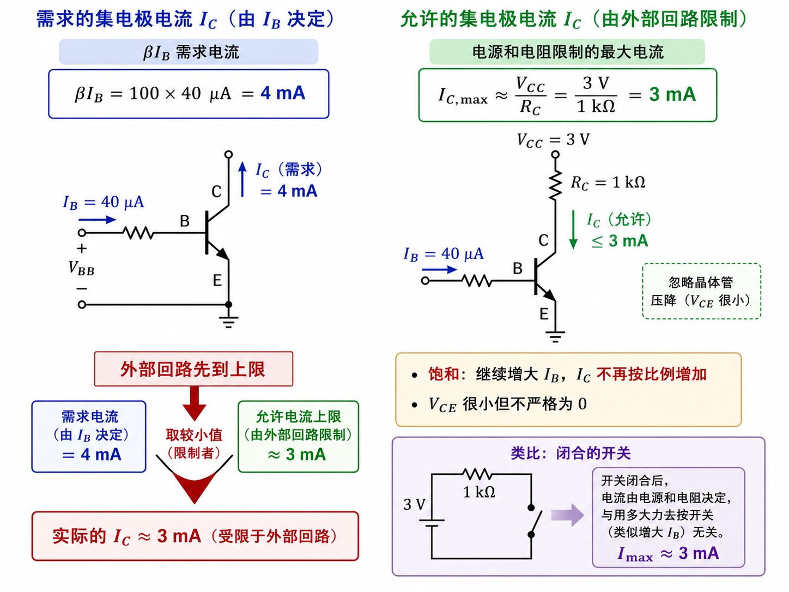

# 同一只晶体管，为什么会像放大器、断路和导线

把 NPN 晶体管的集电极通过 $1\,\text{k}\Omega$ 电阻接到 3 V 电源，发射极接地。此时输出电压不是永远等于 3 V，而是

$$V_{CE}=V_{CC}-I_CR_C.$$

基极电流一变，集电极电流改变，电阻压降也改变。截止、有源、饱和三种状态，就是这两条约束在不同输入下的结果。

## 截止：没有足够注入，输出电流近似为零

$V_{BE}$ 很低时，发射结注入极弱，$I_B\approx0$，$I_C$ 也很小。集电极电阻几乎没有压降，所以 $V_{CE}$ 接近电源电压 3 V。

这叫截止：电流最小，晶体管两端电压最大。它近似一只断开的开关，但“近似”很重要——真实器件仍可能有微小漏电。

## 有源：晶体管关系与外部回路同时容得下

假设 $\beta=100$。当 $I_B=10\,\mu\text{A}$，晶体管倾向于给出 $I_C\approx1\,\text{mA}$；电阻压降为 1 V，剩下 $V_{CE}\approx2\,\text{V}$。当 $I_B=20\,\mu\text{A}$，$I_C\approx2\,\text{mA}$，$V_{CE}\approx1\,\text{V}$。

两次计算既满足 $I_C\approx\beta I_B$，又没有要求电阻压降超过电源电压。因此 $I_C$ 能随 $I_B$ 近似线性变化，这就是有源区，也是用作放大器的范围。

## 饱和：外部电源和电阻先说“不行”

若 $I_B$ 增到 $40\,\mu\text{A}$，按 $\beta I_B$ 会要求 $I_C=4\,\text{mA}$。但 4 mA 流过 1 kΩ 需要 4 V，已经超过 3 V 电源所能提供的总压降。

于是限制电流的不再是 $\beta I_B$，而是外部回路。$I_C$ 只能接近由 $V_{CC}$ 与 $R_C$ 决定的上限，继续增加 $I_B$ 也无法按比例增加 $I_C$；$V_{CE}$ 降到很小，但真实器件并非严格 0 V。这就是饱和。

## 三种状态，其实是在比较两个“允许值”

一个允许值来自晶体管：$\beta I_B$；另一个来自负载：电源通过电阻最多能支持多大电流。有源区中前者较小，晶体管按输入控制输出；饱和区中后者先到上限；截止时则根本没有足够注入。

因此，放大器要把工作点留在中间的有源区。若故意只用两端，截止近似开路，饱和近似闭合，晶体管就不再复制连续变化，而是在两个状态之间切换。
