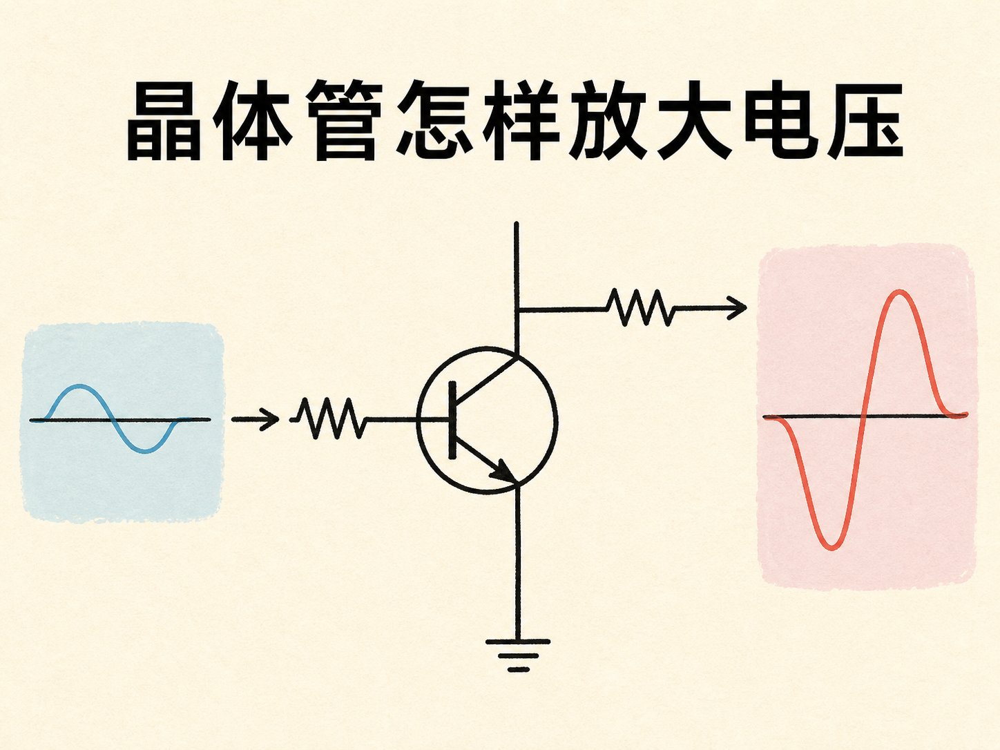
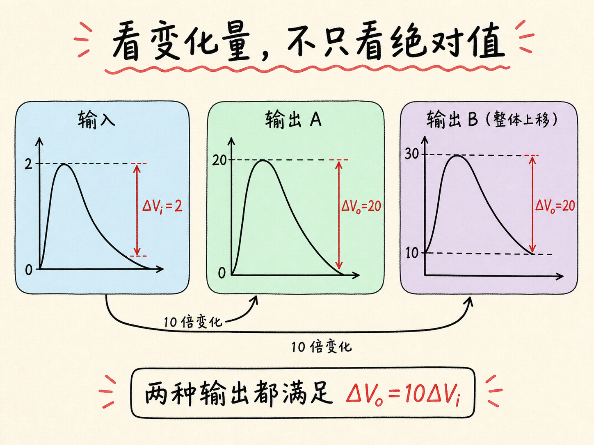
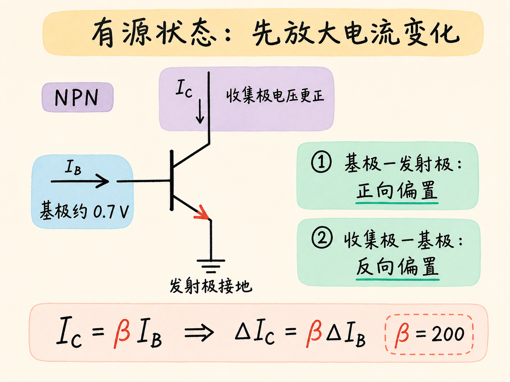
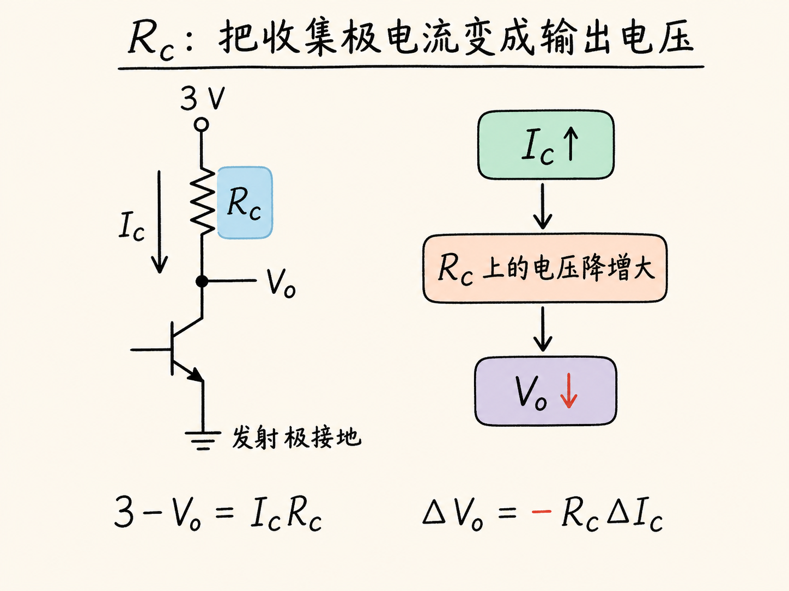
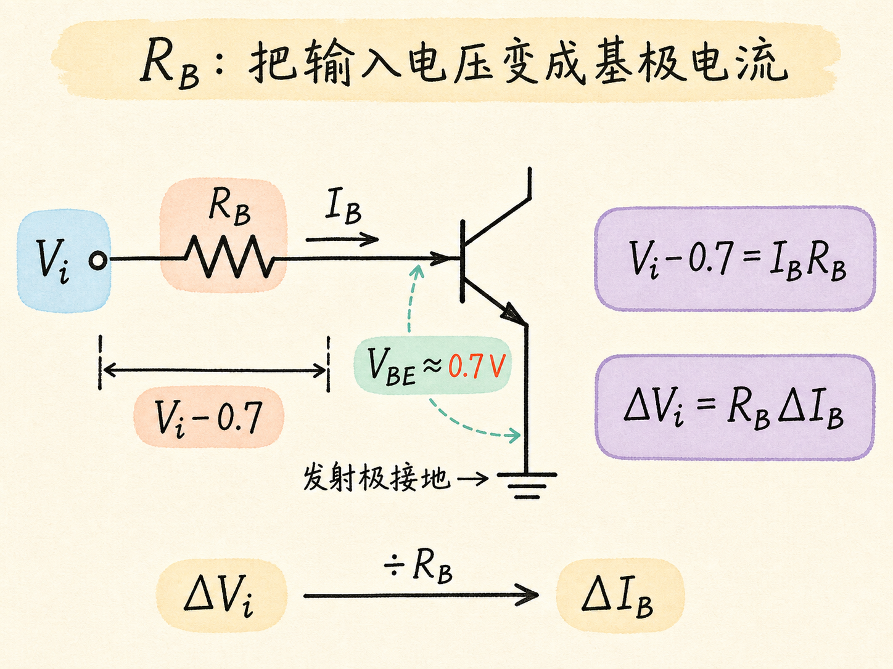
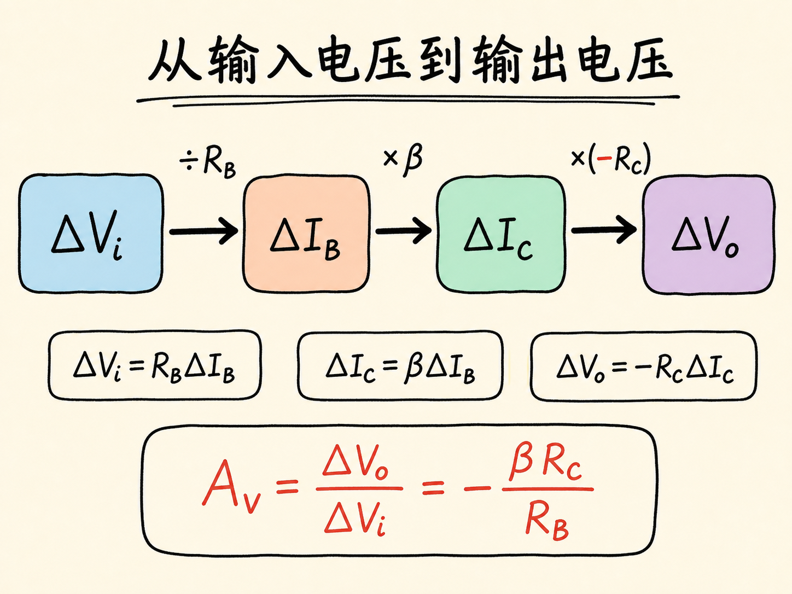
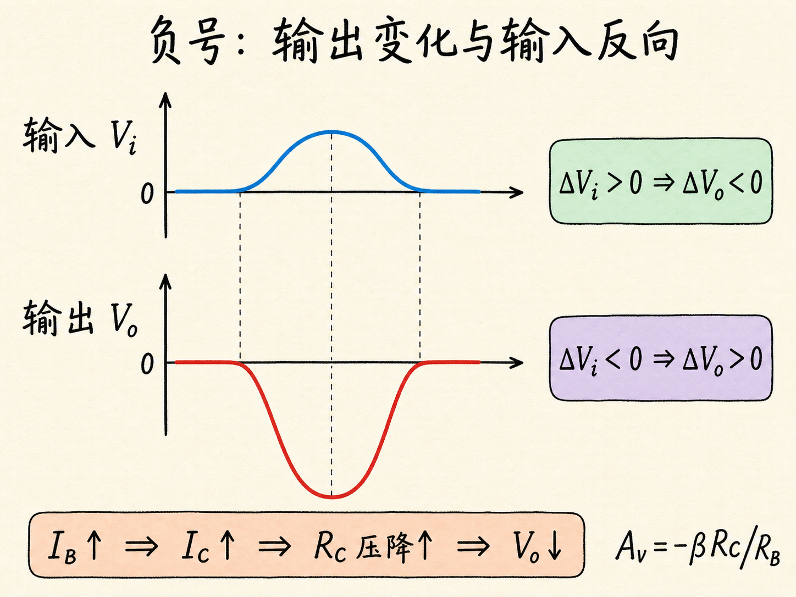

# 晶体管怎样放大电压

晶体管在有源状态下有一个熟悉的关系：收集极电流可以是基极电流的很多倍。可这说明的是电流放大。如果真正想放大的是一个上下波动的输入电压，收集极电流怎样才能变成更大的输出电压变化？

答案藏在两只电阻和一个负号里。基极电阻把输入电压的变化转成基极电流的变化，晶体管把它放大成收集极电流的变化，收集极电阻再把电流变化转回电压变化。每一步都可以用一条简单方程说清。

读完这篇，你会知道

- 为什么判断电压是否被放大，要看电压的变化量，而不是电压的绝对值
- 怎样从 $I_C=\beta I_B$ 得到 $\Delta I_C=\beta\Delta I_B$
- 基极电阻 $R_B$ 和收集极电阻 $R_C$ 分别负责什么
- 为什么电压增益中有一个负号
- 电流增益 $\beta$ 和两只电阻怎样共同决定电压增益

## 放大的关键不是绝对电压

先假设输入电压从 0 上升到 2 个单位，然后再回落到 0。如果要把它放大 10 倍，最直观的输出是从 0 上升到 20，然后回到 0。此时的确有 $V_o=10V_i$。

但如果把这条输出波形整体向上移动 10 个单位，输出就会从 10 上升到 30，再回到 10。这时不再满足 $V_o=10V_i$，可输出的变化幅度仍是 20，正好是输入变化幅度 2 的 10 倍。波形的变化被保留并放大了。

所以，电压放大真正要求的关系是

$\Delta V_o=A_v\Delta V_i$.

$A_v$ 是电压增益。它比较的是输出电压与输入电压的变化量，因此不要求两者的绝对电压始终成固定倍数。

## 先把输入电流的变化放大

现在来看 NPN 晶体管电路。发射极接地，基极约为 $0.7\ \text{V}$，基极—发射极结正向偏置；收集极电压比基极更正，收集极—基极结反向偏置。我们假定晶体管一直处于有源状态，并把收集极相对于接地发射极的电压作为输出电压 $V_o$。

在基极前面接入一个通过电阻 $R_B$ 相连的输入电压源 $V_i$，就有了需要放大的电压信号。有源状态下，收集极电流与基极电流满足

$I_C=\beta I_B$.

如果 $\beta=200$，收集极电流就是基极电流的 200 倍。但我们要跟踪的是变化量。在时刻 $t_1$ 和 $t_2$，上式分别为 $I_{C1}=\beta I_{B1}$ 和 $I_{C2}=\beta I_{B2}$。假定这段时间内 $\beta$ 不变，两式相减就得到

$\Delta I_C=\beta\Delta I_B$.

这条式子说明，基极电流只要变化一点，收集极电流就会以 $\beta$ 倍的变化量跟随它。

## $R_C$ 把输出电流变成输出电压

收集极通过电阻 $R_C$ 接到固定的 $3\ \text{V}$ 电源。电阻上端电压是 $3\ \text{V}$，下端电压是 $V_o$，流过它的电流是 $I_C$。根据欧姆定律，

$3-V_o=I_CR_C$.

比较两个时刻时，$3\ \text{V}$ 电源和 $R_C$ 都不变。将两个时刻的方程相减，得到

$\Delta V_o=-R_C\Delta I_C$.

这个负号很重要。$I_C$ 增大时，$R_C$ 上的电压降增大；由于电阻上端仍被固定在 $3\ \text{V}$，下端的输出电压 $V_o$ 只能降低。所以，收集极电流与输出电压的变化方向相反。

## $R_B$ 把输入电压变成输入电流

输入侧也可以用欧姆定律处理。基极—发射极之间的电压约为 $0.7\ \text{V}$，所以 $R_B$ 两端的电压降是 $V_i-0.7$：

$V_i-0.7=I_BR_B$.

在所讨论的电流范围内，把基极—发射极电压近似看作不变的 $0.7\ \text{V}$，而 $R_B$ 也不变。同样将两个时刻的方程相减，得到

$\Delta V_i=R_B\Delta I_B$.

这里的意思是，输入电压每变化一点，都会通过 $R_B$ 转化成基极电流的变化。

## 三条关系合起来，就得到电压增益

现在已经有三条关系：

$\Delta I_C=\beta\Delta I_B$,

$\Delta V_o=-R_C\Delta I_C$,

$\Delta V_i=R_B\Delta I_B$.

用输出电压变化量除以输入电压变化量，得到

$\frac{\Delta V_o}{\Delta V_i}=-\frac{R_C}{R_B}\frac{\Delta I_C}{\Delta I_B}$.

由于 $\Delta I_C/\Delta I_B=\beta$，所以电压增益为

$A_v=\frac{\Delta V_o}{\Delta V_i}=-\beta\frac{R_C}{R_B}$.

也就是

$\Delta V_o=-\beta\frac{R_C}{R_B}\Delta V_i$.

这就是晶体管电路把电压变化放大的完整链条：$R_B$ 把 $\Delta V_i$ 变成 $\Delta I_B$，晶体管把 $\Delta I_B$ 放大成 $\Delta I_C$，$R_C$ 再把 $\Delta I_C$ 变成 $\Delta V_o$。电压放大倍数的大小取决于 $\beta$、$R_C$ 和 $R_B$。

## 负号表示输出波形反向

如果 $\Delta V_i>0$，上式给出 $\Delta V_o<0$；如果 $\Delta V_i<0$，则 $\Delta V_o>0$。输入电压向上变化时，输出电压按照更大的幅度向下变化；输入向下变化时，输出则向上变化。因此输出波形会相对输入波形翻转。

对电压放大来说，判断它是否工作的关键，是输出电压的变化量是否按固定倍数跟随输入电压的变化量。在晶体管保持有源状态、$\beta$ 和基极—发射极电压都可近似看作不变的条件下，输入与输出的变化方向虽然相反，但放大关系由 $A_v=-\beta R_C/R_B$ 给出。
