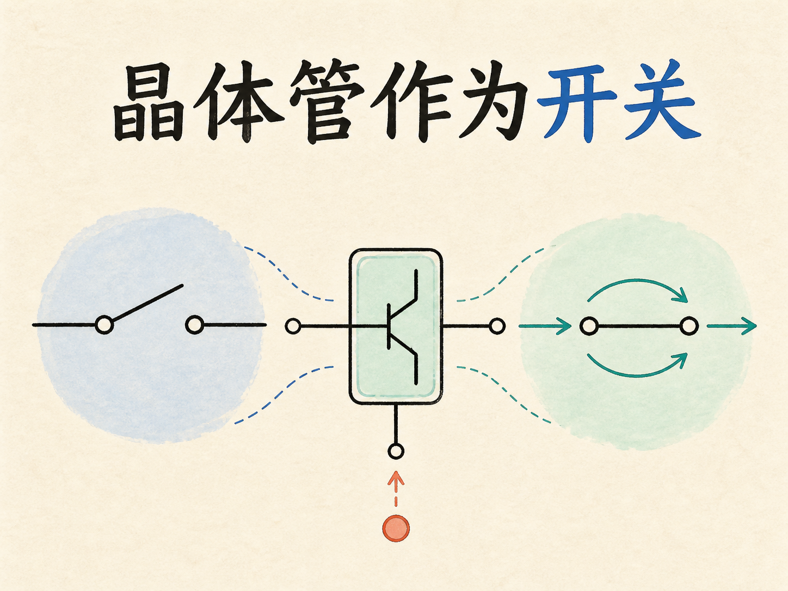
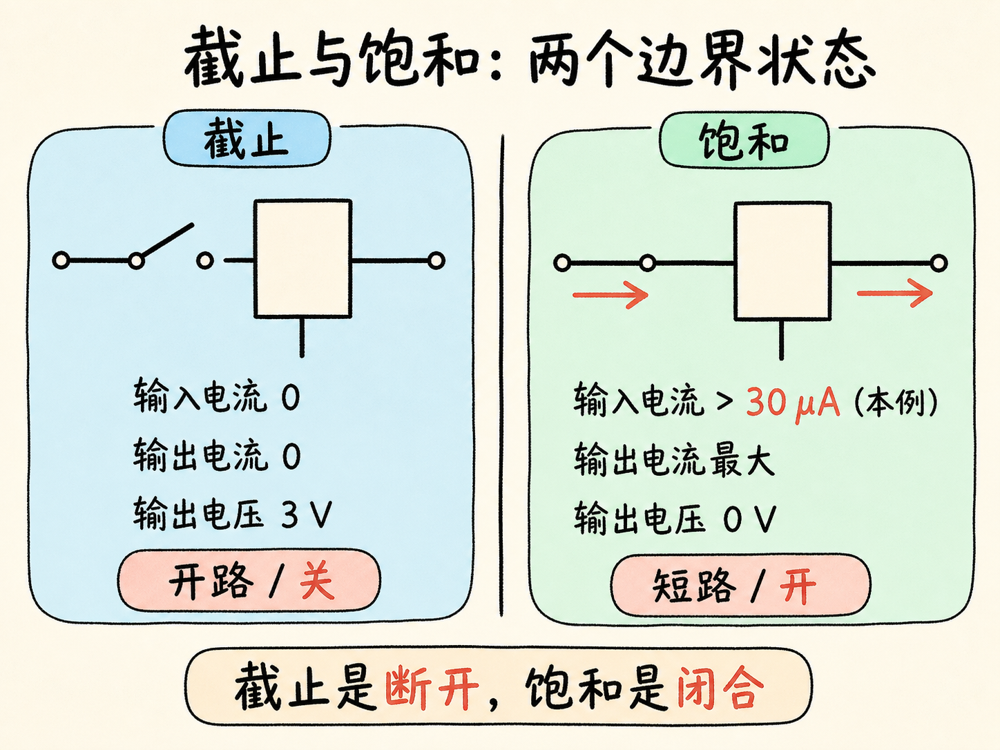
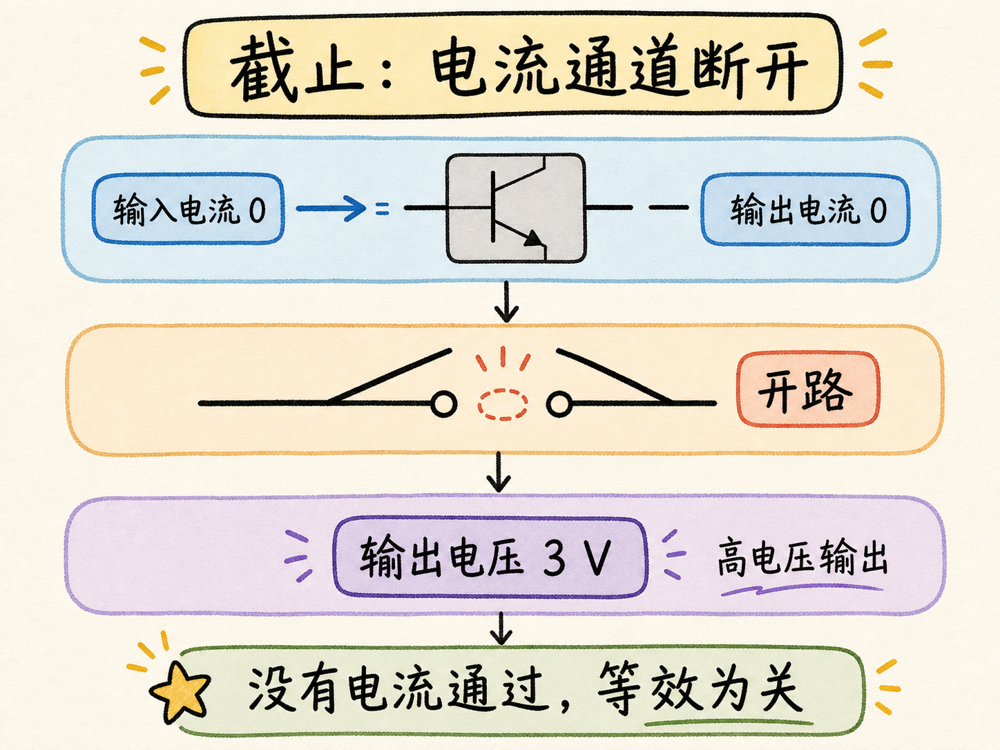
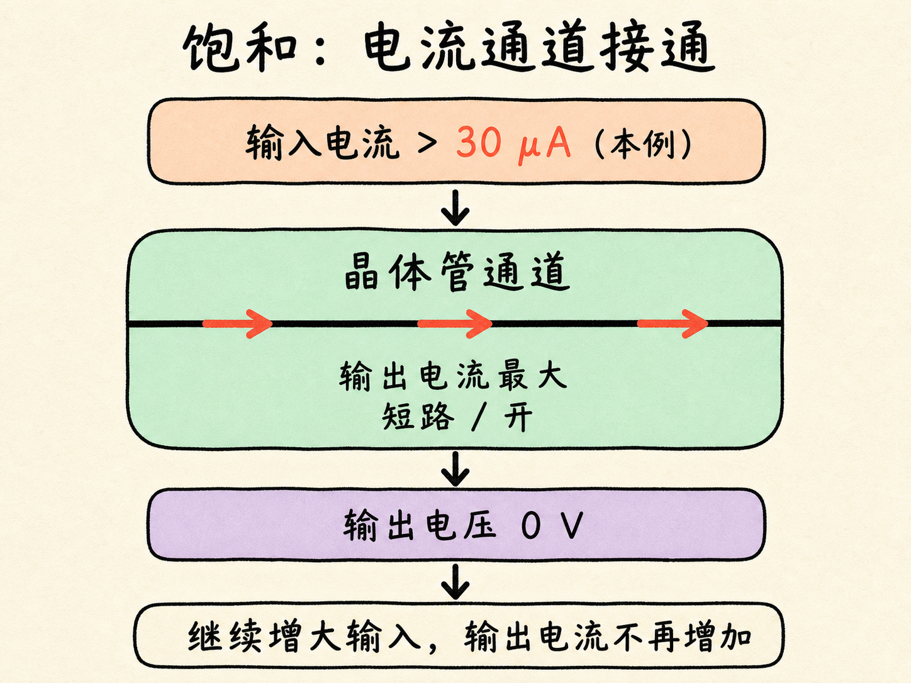
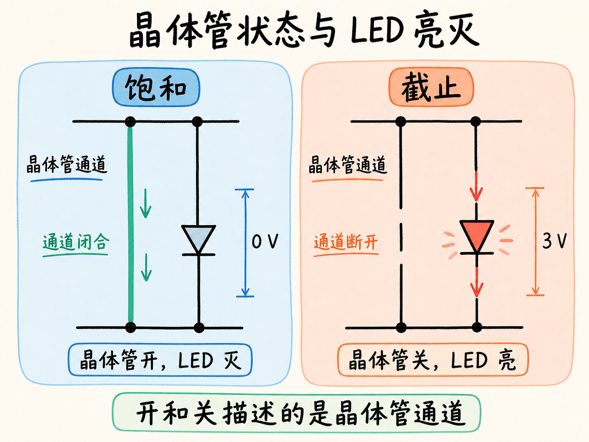
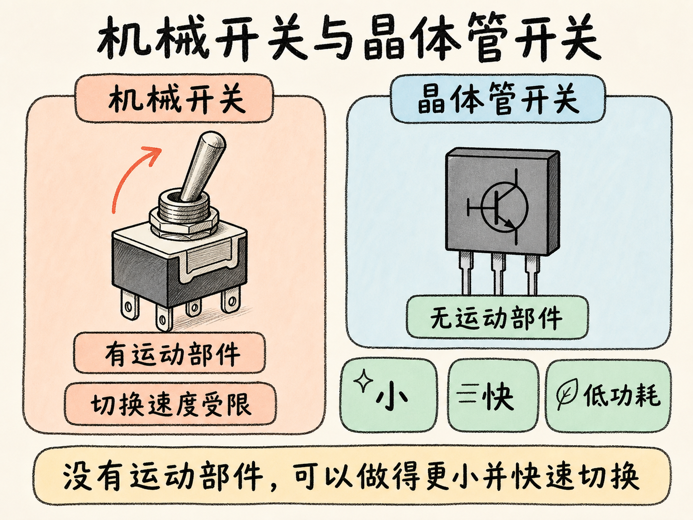
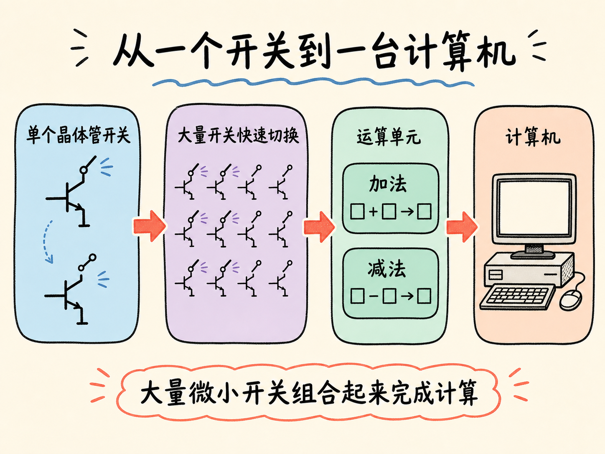

# 晶体管作为开关

同一只晶体管，为什么有时是放大器，有时又像一个开关？关键不在于换了器件，而在于让它工作在不同区域。输入电流处于某个范围时，它可以放大；离开这个范围后，它会进入截止区或饱和区。

开关功能正是从这两个边界状态产生的：截止对应“关”，饱和对应“开”。只要在两种状态之间切换，一个很小的输入电流就能控制另一路电路。

读完这篇，你会知道

- 截止区为什么等效为断开的开关
- 饱和区为什么等效为闭合的开关
- 为什么晶体管“开”时，示例中的 LED 反而熄灭
- 晶体管开关相比机械开关有什么优势
- 大量晶体管开关怎样成为计算机的基础

## 从放大区走向两个边界

先把放大状态放在一边，只看截止和饱和。在示例电路中，这两种状态给出了两组几乎相反的结果。

截止时，输入电流为零，输出电流也为零。在这个示例电路里，输出端与 $3\,\text{V}$ 节点处于相同电位，因此输出电压就是 $3\,\text{V}$，属于高电压输出。

饱和时，电路中流过最大电流。$3\,\text{V}$ 的电压降落在晶体管之前的电路部分，晶体管两端的输出电压降到零。此后继续增加输入电流，输出电流也不再增加。在这个例子中，输入电流超过 $30\,\mu\text{A}$ 后就出现了这种情况，所以称为“饱和”。

## 截止：电流通道被断开

截止区最重要的特征不是“输出电压高”这句话本身，而是晶体管不允许电荷从一端流向另一端。无论相关位置施加的是 $3\,\text{V}$、$4\,\text{V}$ 还是其他电压，这条通道都没有电流。

只看晶体管所在的支路，它就等效为开路。把它画成开关，就是触点分开，状态为“关”。

## 饱和：电流通道被接通

饱和区的情况相反。晶体管允许最大电流通过，输出电压为零，因此它表现得像一条短路通道。

把它画成开关，就是触点闭合，状态为“开”。在这个示例里，当输入电流大于 $30\,\mu\text{A}$ 并进入饱和区时，晶体管对应闭合开关；当输入电流回到零并进入截止区时，晶体管对应断开开关。

在这里，我们不再使用中间的放大状态，而只取两个边界状态：通道接通，或者通道断开。

## 为什么晶体管开，LED 却灭

把 LED 接入这个示例电路后，会出现一个容易让人困惑的现象：晶体管处于“开”状态时，LED 反而不亮。

原因在于电流路径。晶体管进入饱和区后，相当于形成一条短路通道，绝大部分电流沿这条通道流过。LED 支路即使还有极小电流，也不足以让它发光；同时，LED 两端的电压为零，所以 LED 熄灭。

当晶体管进入截止区时，这条短路通道被断开。电荷不能再流过晶体管，只能经过 LED 所在的路径。完整的 $3\,\text{V}$ 加到 LED 两端，LED 导通并发光。

因此，这个电路的对应关系是：

- 晶体管饱和，晶体管“开”，LED 灭；
- 晶体管截止，晶体管“关”，LED 亮。

这并不矛盾。“开”和“关”描述的是晶体管通道本身，LED 的亮灭取决于这个通道怎样改变 LED 两端的电压和电流路径。

## 为什么不用机械开关

机械开关也能完成接通和断开，但它有运动部件。运动部件会限制切换速度，而晶体管没有运动部件，所以能够非常快地切换。

晶体管开关消耗的电功率很小，因此功耗低、效率高。它还可以做得非常小，于是很小的空间里就能容纳大量开关。

这些优势可以概括为三个词：小、快、低功耗。它们使大量晶体管开关能够被组合起来，构成执行加法、减法和其他数学计算的运算单元，最终组成计算机。

## 收束：两个边界状态就是一个开关

晶体管作为开关，并不是额外增加了一套神秘功能，而是利用了它原本就有的两个边界状态：截止时没有电流，等效为断开；饱和时通过最大电流，等效为闭合。

从控制一个 LED，到支撑电脑游戏或视频播放，背后的基本动作没有改变：大量微小的晶体管开关，在“开”和“关”之间快速切换。
